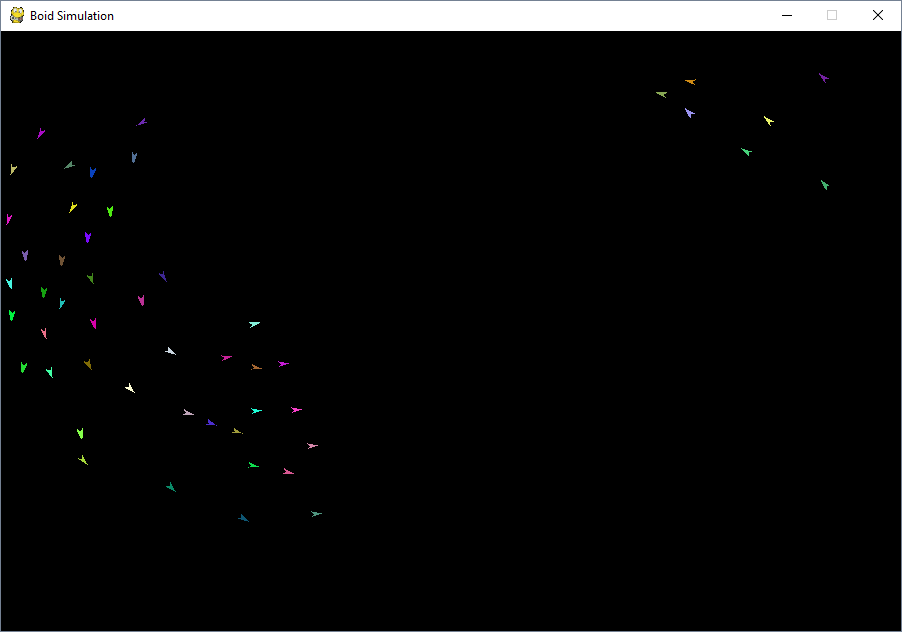
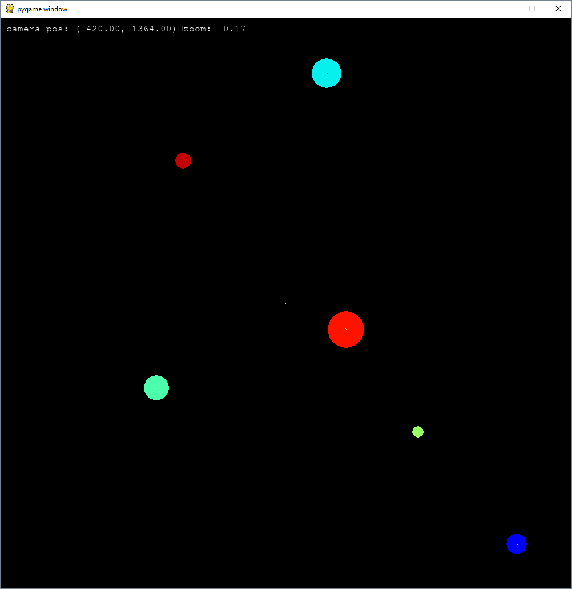

# Pygame Experiments

A few little experiments I did to try out the pygame package

## Boids

This is a simple boids implementation, where the boid behaviours are written in an extensible OOP way.

To add a new behavioural rule you need to implement the `BoidRule` abstract base class and add it to the flock rules 
in the `boids_simulation.py` script

An example set of rules for a flock are:

```python
flock = BoidFlock(game_settings)
flock_rules: List[BoidRule] = [
    # FearMePunyBoidRule(weighting=1, game_settings=game_settings, entity_to_fear=character, push_force=-100),
    CohesionRule(weighting=0.5, game_settings=game_settings),
    AlignmentRule(weighting=1, game_settings=game_settings),
    NoiseRule(weighting=1, game_settings=game_settings),
    AvoidWallsRule(weighting=1, game_settings=game_settings, push_force=100),
    SimpleSeparationRule(weighting=1, game_settings=game_settings, push_force=boid_fear),
    # SpiralRule(weighting=0.01, game_settings=game_settings),
    ControlRule(weighting=1, game_settings=game_settings, control_factor=1)
]
flock.generate_boids(n_boids, rules=flock_rules, local_radius=boid_radius, max_velocity=boid_max_speed,
                     controls=default_controls)
```

Cohesion, Alignment, and Separation are the core boid behaviours and the others are ones I was playing around with. 

The `FearMePunyBoidRule` made the boids avoid an entity, which could be a player controlled entity.

The `NoiseRule` added noise to their movement to make it a bit more interesting

The `SpiralRule` made the boids want to spin counter clockwise

And the `ControlRule` allowed the user to influence the boids movements with keyboard input.
 
The implementation uses pure python for most of the calculations, this means it's pretty slow, and on my computer it can only run 
around 50 boids without a lowered frame-rate. Future work would be to write the calculations (rules) using numpy to 
leverage the compiled code speed.

Here is a screenshot of the simulation in action.



## Gravity/Planet Simulation

I made a gravity simulation using the same simple engine that I made in the boids simulation, but added mass and the 
force of gravity. In this little simulation you control a small blue spaceship and fly around some planets.

It's very simplified with no collision detection so there are some weird behaviours when objects get too close to each 
other.

Probably the most interesting part of this project for me was writing code for camera control. And learning about 
abstracting graphics.


